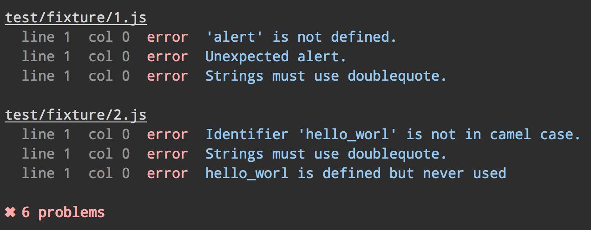

# grunt-eslint [](http://travis-ci.org/sindresorhus/grunt-eslint)

Validate files with [ESLint](https://github.com/nzakas/eslint).

> ESLint is a tool for identifying and reporting on patterns found in ECMAScript/JavaScript code. In many ways, it is similar to JSLint and JSHint with a few exceptions:

>- ESLint uses Esprima for JavaScript parsing.
>- ESLint uses an AST to evaluate patterns in code.
>- ESLint is completely pluggable, every single rule is a plugin and you can add more at runtime.




## Getting Started

If you haven't used [grunt][] before, be sure to check out the [Getting Started][] guide, as it explains how to create a [gruntfile][Getting Started] as well as install and use grunt plugins. Once you're familiar with that process, install this plugin with this command:

```sh
npm install --save-dev grunt-eslint
```

Once the plugin has been installed, it may be enabled inside your Gruntfile with this line of JavaScript:

```js
grunt.loadNpmTasks('grunt-eslint');
```

[grunt]: http://gruntjs.com
[Getting Started]: https://github.com/gruntjs/grunt/wiki/Getting-started


## Documentation

See the grunt [docs](https://github.com/gruntjs/grunt/wiki) on how to [configure tasks](https://github.com/gruntjs/grunt/wiki/Configuring-tasks) and more advanced usage.

### Example

```js
grunt.initConfig({
	eslint: {					// task
		target: ['file.js']		// array of files
	}
});

grunt.loadNpmTasks('grunt-eslint');
grunt.registerTask('default', ['eslint']);
```

### Example with custom config and rules

```js
grunt.initConfig({
	eslint: {								// task
		options: {
			config: 'conf/eslint.json',		// custom config
			rulesdir: 'conf/rules'			// custom rules
		},
		target: ['file.js']					// array of files
	}
});

grunt.loadNpmTasks('grunt-eslint');
grunt.registerTask('default', ['eslint']);
```


### Options

#### config

Type: `String`  
Default: [built-in eslint.json](https://github.com/iancmyers/eslint-grunt/blob/master/tasks/conf/eslint.json)

Path to your [ESLint config file](https://github.com/nzakas/eslint/blob/master/docs/rules/README.md) (`eslint.json`).

#### rulesdir

Type: `String`  
Default: [built-in rules directory](https://github.com/nzakas/eslint/tree/master/lib/rules)

Path to a directory with custom rules. Your custom rules will be used in addition to the built-in ones.

Recommended read: [Working with Rules](https://github.com/nzakas/eslint/blob/master/docs/developer-guide/working-with-rules.md)

#### formatter

Type: `String`  
Default: [`node_modules/eslint-stylish/stylish.js`](https://github.com/sindresorhus/eslint-stylish)

Name of a [built-in formatter](https://github.com/nzakas/eslint/tree/master/lib/formatters) or path to a custom one.


## License

MIT © [Sindre Sorhus](http://sindresorhus.com)
